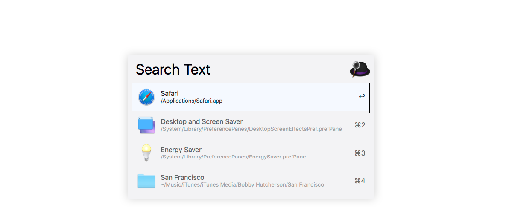
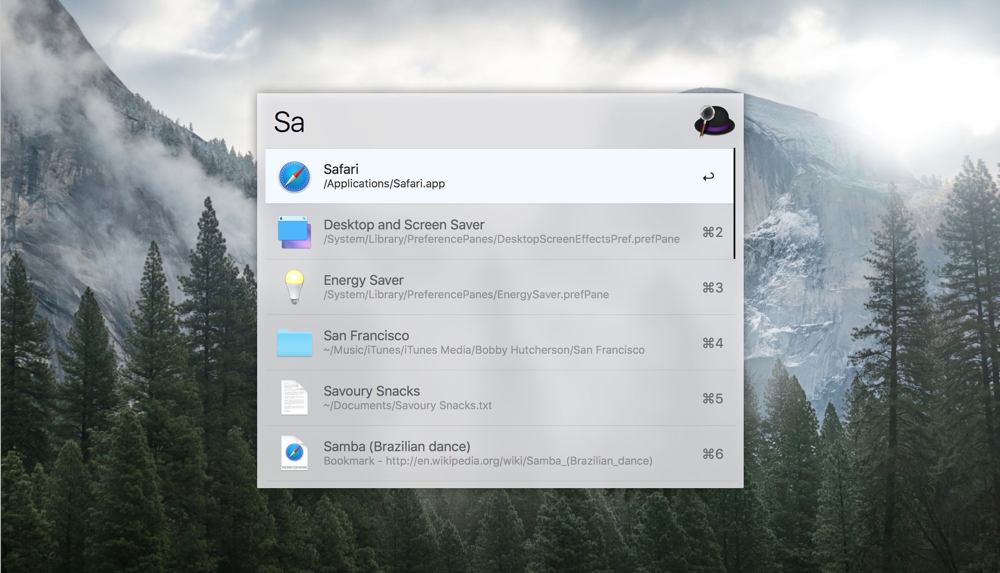

# Total Clean for [Alfred 3](http://alfredapp.com)

> An extremely clean and minimal theme for [Alfred 3](http://alfredapp.com).

## Preview

## How to use?

1. Download:

  *  $ git clone https://github.com/thanasisrig/total-clean.git

2. Apply:

	* Double-click on `Total Clean.alfredappearance`

> Download Total Clean for [ZSH](http://zsh.org).

#### Big thanks to [Petros](https://github.com/pmitakos).
